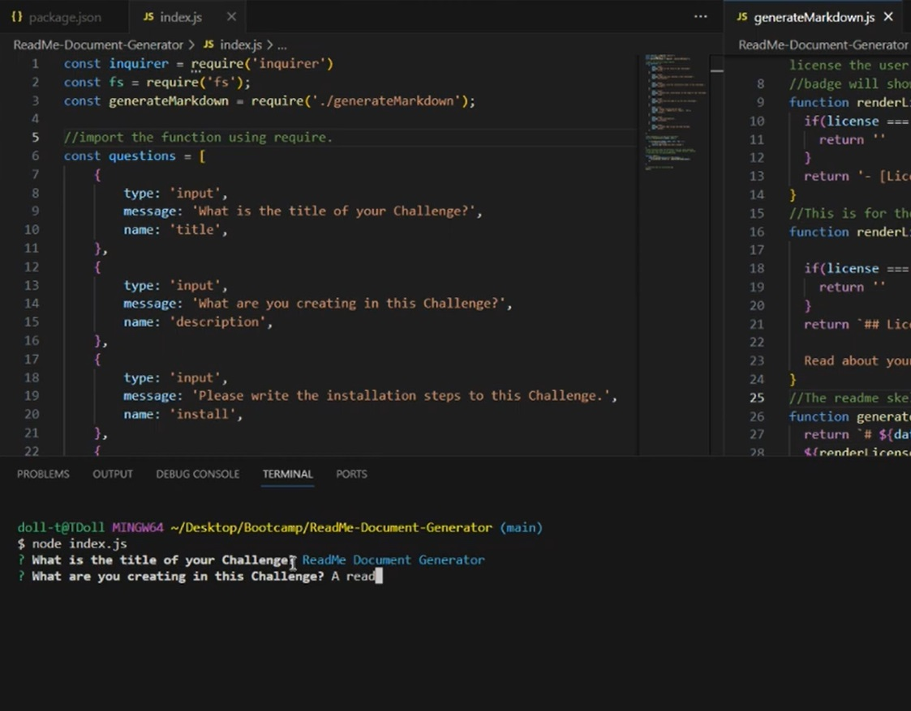
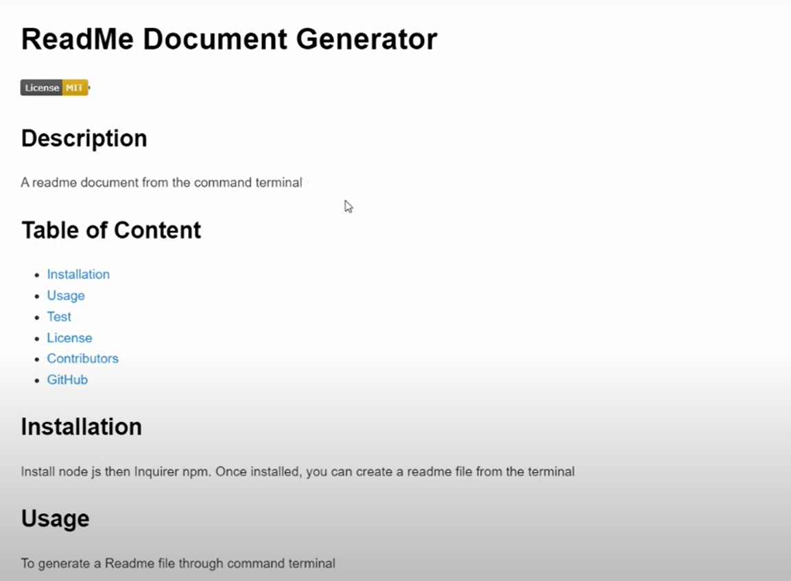

# ReadMe document via terminal
09 Node.js Challenge: Professional README Generator

**Goal**
To create a command-line application that dynamically generates a professional README.md file from a user's input using the Inquirer package. 

**Scope of Work**
The user will answer series of questions via command line to generate a ReadMe Document. 

**The ReadMe should contain the following sections:**
Title
Installation
Description
License
Usage
Test 
Contribute

**The questions user is asked to answer in the terminal**

**Once all answered the ReadMe document is generated**

**Link to the ReadMe Generator**
https://drive.google.com/file/d/12pK97BHJxeM7oHoq9Wcub4gSalykOT7q/view 

**Package**
Node js

**Languages**
JavaScript

**Libraries**
Inquirer 8.2.4

**Credits**
Edited by Kai Gurung-Doll; https://github.com/KaiDoll.
Link to the Challenge: https://kaidoll.github.io/ReadMe-Document-Generator/